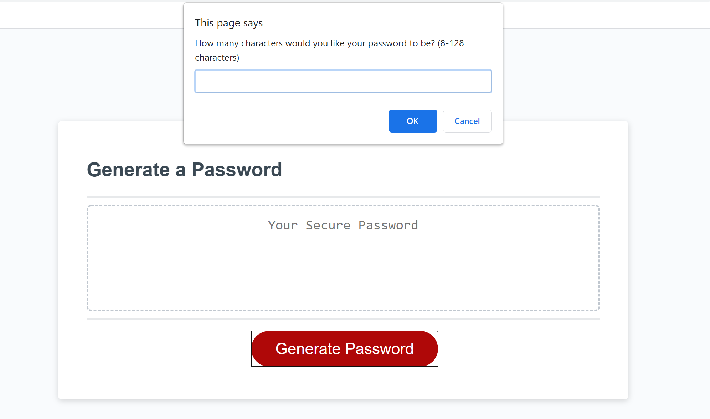

# Description
This site generates a random password based on user inputs. Asks user if they want to include uppercase characters, numeric characters, and special characters. Then a random password is generated and applied to the "your password" text box. 

Here is what the site looks like:

## Deployed Site
Here is the link to generate your password on the deployed site: [Deployed Site](https://julesscheil.github.io/Random-Password-Generator/)